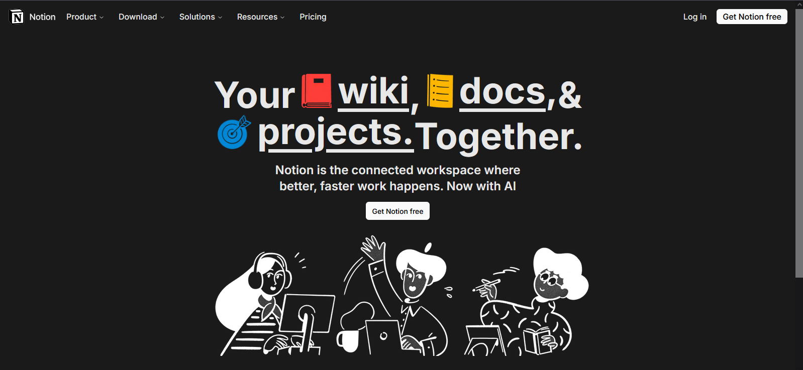

# Notion Clone - Aplikasi Manajemen Catatan Modern

 <!-- Ganti dengan screenshot aplikasi Anda -->

Aplikasi ini adalah kloning sederhana dari Notion, dibangun menggunakan **Next.js**, **MongoDB**, dan **Clerk**. Aplikasi ini memungkinkan pengguna untuk membuat, mengedit, dan mengelola catatan secara real-time dengan antarmuka yang intuitif.

## Fitur Utama

- **Autentikasi Pengguna**: Menggunakan Clerk untuk manajemen autentikasi (login, register, dan manajemen profil).
- **CRUD Catatan**: Buat, baca, perbarui, dan hapus catatan.
- **Editor Rich Text**: Menggunakan editor untuk format teks (seperti bold, italic, list, dll.).
- **Organisasi Catatan**: Kelola catatan berdasarkan kategori atau tag.
- **Real-Time Sync**: Perubahan disinkronkan secara real-time ke database MongoDB.
- **Responsive Design**: Antarmuka yang ramah untuk desktop dan mobile.

## Teknologi yang Digunakan

- **Frontend**: 
  - Next.js (React framework)
  - Tailwind CSS (styling)
  - TipTap (editor rich text)
- **Backend**:
  - Next.js API Routes
  - MongoDB (database)
- **Autentikasi**:
  - Clerk (manajemen pengguna dan autentikasi)
- **Lainnya**:
  - Prisma (ORM untuk MongoDB)
  - React Query (HTTP client)
  - Vercel (deployment)

## Cara Menjalankan Proyek Secara Lokal

### Prasyarat

- Node.js (v16 atau lebih baru)
- MongoDB (Anda bisa menggunakan [MongoDB Atlas](https://www.mongodb.com/cloud/atlas) untuk database cloud)
- Akun Clerk (untuk autentikasi, daftar di [Clerk](https://clerk.dev/))

### Langkah-Langkah

1. **Clone repositori ini**:
   ```bash
   git clone https://github.com/username/notion-clone.git
   cd notion-clone
   ```

2. **Instal dependensi:**:
   ```bash
   npm install --force #gunakan --force
   ```

3. **Buat Environment Variabel Sesuai Contoh**
4. **Jalankan server development**
   ```bash
   npx prisma generate
   npx prisma db push
   npm run dev
   ```

<br><br>
Dibuat dengan ❤ oleh Lndn
<br>
Demo: https://notion-lndn-lake.vercel.app
